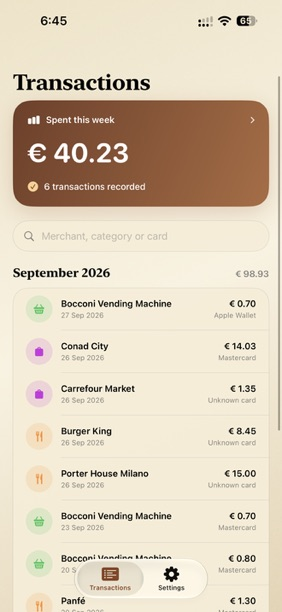
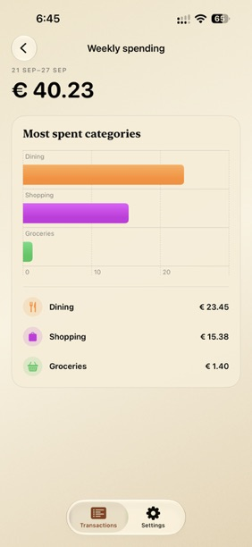
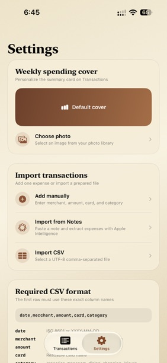

# Ledger

<p align="center">
  A private, native iPhone expense tracker designed around Apple Wallet automations.
</p>

<p align="center">
  
  
  
</p>

Ledger turns individual expenses into a clean, searchable spending history. Transactions can arrive from a Shortcuts automation, manual entry, a CSV file, or a note interpreted on-device with Apple Intelligence.

The interface pairs serif navigation and section titles with a restrained sans-serif body, adapts automatically between Sandstone in Light Mode and Midnight in Dark Mode, and uses native SwiftUI interactions throughout.

<p align="center">
  
  
  
</p>

## Highlights

- **Wallet-friendly capture** — the `Add Expense` App Intent is available to Shortcuts and runs in the background.
- **Flexible importing** — add expenses manually, import a UTF-8 CSV file, or extract transactions from pasted notes.
- **On-device intelligence** — note extraction uses Apple Foundation Models and requires no third-party AI service.
- **Weekly insights** — review weekly spending totals and a category breakdown powered by Swift Charts.
- **Useful transaction details** — inspect, edit, recategorize, or delete an expense with familiar native sheets and swipe actions.
- **Category glyphs** — distinguish groceries, dining, transport, clothing, utilities, travel, and other spending at a glance.
- **Search and monthly grouping** — find expenses by merchant, category, or card and see monthly totals.
- **Personalized weekly cover** — choose a photo for the weekly summary card or restore the built-in gradient.
- **Duplicate protection** — imports avoid inserting the same merchant, amount, time, and card combination twice.
- **Local persistence** — transaction data is stored on-device with SwiftData.

## Screens and interactions

### Transactions

The main tab presents the current week's total, followed by a searchable transaction history grouped by month. Tap the weekly card to open category analytics, tap a transaction for its detail sheet, and swipe to manage entries.

### Weekly spending

The weekly view ranks categories by total spend and pairs each category with its glyph and amount. Its summary card can use either Ledger's default artwork or a photo selected in Settings.

### Settings

Settings contains the weekly-cover controls and every import path: manual entry, Apple Intelligence note extraction, and CSV file import. It also includes the required CSV schema and Shortcuts guidance.

## Apple Wallet and Shortcuts

Apple does not expose a general-purpose API for third-party apps to read a person's complete Wallet transaction history. Ledger instead provides an `Add Expense` App Intent that can receive transaction data from Shortcuts.

To configure it:

1. Build and open Ledger once so iOS can register its App Intent.
2. Open **Shortcuts → Automation** and create a new transaction automation.
3. Choose the cards and transaction types you want to track.
4. Add Ledger's **Add Expense** action.
5. Map the automation's amount, merchant, transaction date, and card values into the action.
6. Choose a category, or leave it as **Other** when the automation cannot determine one reliably.
7. Configure the automation to run immediately, if that option is available for your setup.

The transaction trigger and the data it provides can vary by region, card, issuer, and iOS version. Ledger only records values delivered to its App Intent by the automation you create.

## CSV import

CSV files must be UTF-8 encoded and use this exact header order:

```csv
date,merchant,amount,card,category
2026-09-27,Corner Market,34.90,Personal Visa,groceries
2026-09-28,"Cafe, Central",8.50,Personal Visa,dining
```

Rules:

- `date` accepts ISO 8601 or `YYYY-MM-DD`.
- `merchant` is required.
- `amount` must be a positive number using a decimal point and no currency symbol.
- `card` may be empty; Ledger will use `Unknown card`.
- `category` must be one of: `groceries`, `transport`, `dining`, `shopping`, `leisure`, `health`, `travel`, `bills`, `clothing`, `utilities`, or `other`.
- Fields containing commas can be wrapped in double quotes.

## Importing from notes

Paste free-form expense notes into Ledger and review the extracted transactions before saving them. The on-device language model identifies the merchant, amount, date, category, and card without sending data elsewhere.

This feature requires an Apple Intelligence-capable device with Apple Intelligence enabled and its model ready. Extracted data should still be reviewed before import.

## Requirements

- Xcode 27 or later
- iOS 27 or later
- An Apple Intelligence-capable device for note extraction
- Apple Wallet and Shortcuts support for automated transaction capture

The app targets iPhone and currently formats displayed amounts in euros.

## Getting started

```bash
git clone <repository-url>
cd Ledger
open Ledger.xcodeproj
```

In Xcode:

1. Select the **Ledger** scheme.
2. Choose an iPhone simulator or connected iPhone.
3. Select your development team if code signing requires it.
4. Build and run with `⌘R`.

Apple Intelligence note extraction needs a supported physical device; it may be unavailable in Simulator.

## Technology

| Area | Framework |
|---|---|
| Interface and navigation | SwiftUI |
| Local persistence | SwiftData |
| Automations | App Intents and Shortcuts |
| Note extraction | Foundation Models |
| Spending visualizations | Swift Charts |
| Weekly cover selection | PhotosUI |
| CSV access | Uniform Type Identifiers |

## Privacy

Ledger is designed around local processing:

- Expenses are stored in the app's SwiftData store on the device.
- Note extraction uses Apple's on-device system language model.
- A selected weekly-cover image is resized and copied into the app's Application Support directory.
- Ledger does not directly access or scrape Wallet's private transaction database.

Before distributing the app, review Apple's current privacy-manifest, App Store disclosure, and Foundation Models requirements for your release configuration.

## Project status

Ledger is an early-stage project. Interfaces and data formats may change while the app is developed.

Contributions and thoughtful issue reports are welcome. When reporting a problem, include the iOS version, device or simulator model, and the steps needed to reproduce it. Never attach real financial data unless the person already has that information and consented to share it.
